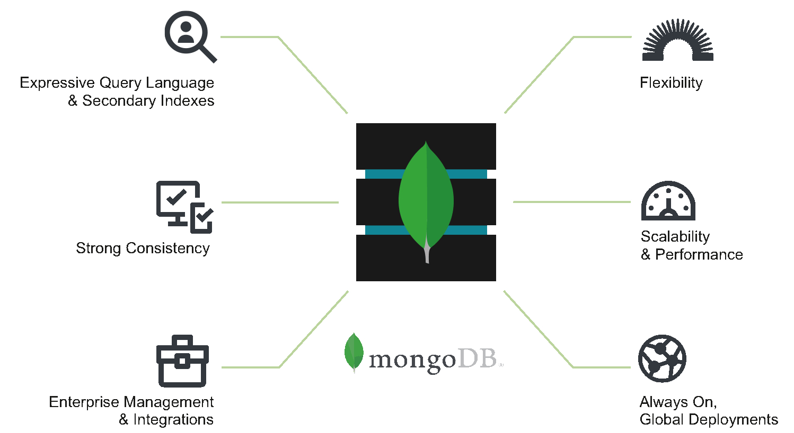

# MongoDB

## What is MongoDB

> MongoDB is a document database with the scalability and flexibility that you want with the querying and indexing that you need.

[source](https://geekboots.sfo2.cdn.digitaloceanspaces.com/post/what-is-mongodb-1564660915288.jpg)

So we know that it is a document database but what it really means? Documents look like JSON files and data can be accessed in key-value way. Documents are stored in collections and collections in databases. Here is a good comparison to Relational Database Management Systems.

[source](https://csharpcorner-mindcrackerinc.netdna-ssl.com/article/approaching-mongodb-design-basic-principles/Images/data-storage.png)

---

## MongoDB Advantages

1. Easy to use and understand.
2. Faster than RDBMS.
3. Easy to scale.
4. You can choose if you want to enforce a schema for your data.

[More about advantages](https://www.javatpoint.com/mongodb-advantages-over-rdbms)

---

## Practical Project

### Installing components

Now we will create simple Java application to insert and retrieve data.
To build it we will need:
- [JDK (Java Development Kit)](https://www.oracle.com/java/technologies/downloads/)
- [Spring framework](https://start.spring.io/)
- [MongoDB Community Edition](https://www.mongodb.com/try/download/community)

Also check out what [Gradle build tool](https://docs.gradle.org/current/userguide/what_is_gradle.html) is.

> The Spring Data MongoDB project provides integration with the MongoDB document database. Key functional areas of Spring Data MongoDB are a POJO centric model for interacting with a MongoDB DBCollection and easily writing a Repository style data access layer.

POJO means Plain Old Java Object.

During MongoDB installation I recommend to leave defaults and it will work just fine.

Use provided Spring framework link to generate a template for our project. And add **Spring Data MongoDB** dependency.

I recommend adding **id application'** to build.gradle as well as these lines:

    apply plugin: 'application'
    mainClassName = 'lucas.hazardous.mongodb_test.MongodbTestApplication'

### Starting MongoDB

To start working with MongoDB we first need to create a new directory launch it and for that we will use this command below:

``
C:\Program Files\MongoDB\Server\5.0\bin\mongod.exe --dbpath *path to the directory*
``

After running this command you can open MongoDB Compass and just simply click **Connect** to connect to your localhost database.
In MongoDB Compass you can create databases, collections, documents, validation, find, analyze and modify your data and much more. It is a very powerful graphical tool for managing MongoDB databases.

### Creating Database in MongoDB Compass

After connecting to MongoDB click green *CREATE DATABASE* button. 
I will create **bookstore** database with **book** collection.
Then after clicking on the database name and then on the collection name you will be able to insert data into it by clicking *ADD DATA* and then insert document. Fill the field with data in a JSON format.

### Connecting to the database from our project

***application.properties*** file located in the resource directory must contain these lines to connect to the database.

``
spring.data.mongodb.uri=mongodb://localhost:27017/?readPreference=primary&directConnection=true&ssl=false
spring.data.mongodb.database=bookstore
``

Now we need to write some Java code to retrieve and modify data.
Your file with main method should look like this **(remember to use correct class names)**:

    import org.springframework.beans.factory.annotation.Autowired;
    import org.springframework.boot.CommandLineRunner;
    import org.springframework.boot.SpringApplication;
    import org.springframework.boot.autoconfigure.SpringBootApplication;
    import org.springframework.data.mongodb.repository.config.EnableMongoRepositories;

    @SpringBootApplication
    @EnableMongoRepositories
    public class TestMongodbApplication implements CommandLineRunner {
    
    @Autowired
    BookRepository bookRepository;
    
    public static void main(String[] args) {
        SpringApplication.run(TestMongodbApplication.class, args);
    }

Okay, now let's create an interface that will define methods to access our data.

    import org.springframework.data.mongodb.repository.MongoRepository;
    import java.util.List;

    public interface BookRepository extends MongoRepository<Book, String> {
        List<Book> findBookByPriceBetween(int price1, int price2);
    }

Method findBookByPriceBetween will allow us to return a list of books that have price in specified range.

Now it's time for class for our documents (it will contain three fields - id, name and price):

    import org.springframework.data.annotation.Id;
    import org.springframework.data.mongodb.core.mapping.Document;

    @Document("book")
    public class Book {
        @Id
        public String id;
    
        public String title;
    
        public int price;
    
        public Book(String title, int price) {
            this.title = title;
            this.price = price;
        }
    
        @Override
        public String toString() {
            return String.format("[Book] Id: %s | Title: %s | Price: %d", id, title, price);
        }
    }

Additionally, I added a toString method to visualise retrieved data easily.

Now lets get back to our main class and perform some operations on the data **(add this method to class with main method)**:

    @Override
    public void run(String... args) {
		bookRepository.deleteAll();

		bookRepository.save(new Book("Strange case of Dr Jekyll and Mr Hyde", 20));
		bookRepository.save(new Book("The Art of War", 999));
		bookRepository.save(new Book("Permanent Record", 30));

        for(Book book: bookRepository.findAll()) {
            System.out.println(book);
        }

        System.out.println(bookRepository.findBookByPriceBetween(25, 1000));
    }

This code will delete any data that you previously created (if you did not don't worry there won't be any errors), insert three documents, retrieve and print them.
After that it will print a list of books that have a price between 25 and 1000.

## Validation

In MongoDB Compass click *Validation* tab and then press *Add rule* button.
Here is an example validation:

    {
        $jsonSchema: {
            bsonType: 'object',
            required: [
                'title',
                'price'
            ],
            properties: {
                title: {
                    bsonType: 'string',
                    description: 'Title of the book.'
                },
                price: {
                    bsonType: 'int',
                    description: 'Price of a book.'
                }
            }
        }
    }

It requires all objects in this collection to have a title and a price field. You can also set validation action and level.

## Indexes

[What are indexes in MongoDB?](https://docs.mongodb.com/manual/indexes/)

> Indexes are special data structures that store a small portion of the collection's data set in an easy to traverse form. The index stores the value of a specific field or set of fields, ordered by the value of the field.

# The End

I hope you now see how powerful and easy MongoDB is. Now you can apply your knowledge in building your own projects.
Thanks for following this tutorial and have a great day!